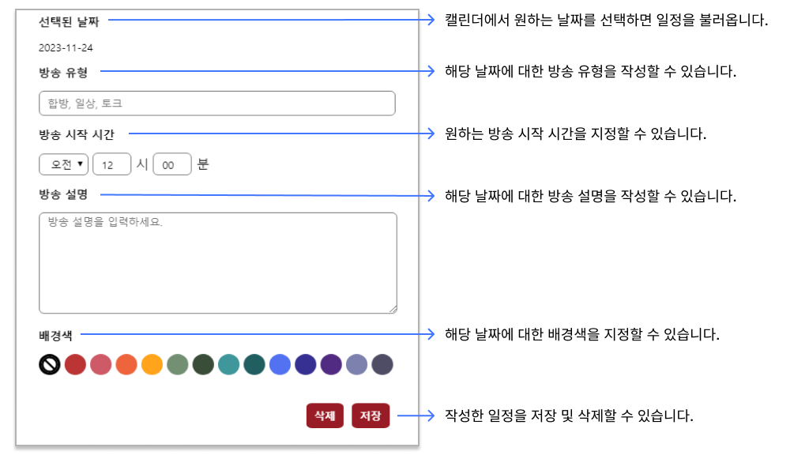

# AfreecaTV BJ Calendar

> BJ캘린더는 BJ들과 시청자 간의 간편하고 원활한 일정 공지를 위해 제작된 익스텐션입니다.

시청자들은 BJ가 작성한 캘린더를 볼 수 있고, 업데이트 버튼을 통해 캘린더를 갱신할 수 있습니다.

BJ들은 본인의 캘린더에 일정을 추가하거나 삭제하고, 시청자와 공유할 수 있습니다.

캘린더에서는 다음과 같은 내용 작성이 가능합니다.

- 방송 유형
  - 방송 유형은 10글자 이하로 작성이 가능하며 작성시 캘린더에 표시됩니다.

- 방송 시작시간
  - 작성하지 않을 경우 방송시간이 없습니다로 표시됩니다.

- 방송 설명
  - 방송에 대한 자세한 설명을 작성할 수 있습니다.

- 배경색
  - 등록한 일정의 배경색을 지정할 수 있습니다. 지정한 배경색이 캘린더에 표시됩니다.

각 캘린더의 공유, 업데이트는 해당 BJ의 방송에 참여했을때 가능합니다.

---

> The BJ Calendar is an extension designed for a simple and smooth schedule announcement between BJs and viewers.

Viewers can view the calendar created by BJ and update the calendar through the Update button.

BJs can add or delete schedules to their calendar and share them with viewers.

You can create the following in the calendar.

- Type of broadcasting
  - The broadcast type can be written in less than 10 characters and will be displayed on the calendar when writing.

- Time to start the broadcast
  - If you do not create it, you will see No airtime.

- Explanation of the broadcast
  - You can create a detailed description of the broadcast.

- Background color
  - You can specify a background color for a registered schedule. The background color you specify appears on the calendar.

Sharing and updating each calendar is possible when you participate in the BJ's broadcast.

|BJ List View|
|---|
||

|BJ Calendar View|
|---|
|| 

|Input Form View|
|---|
||

## Contributors
* **honggibeom:** `https://github.com/honggibeom`
* **sooyeoniya:** `https://github.com/sooyeoniya`
